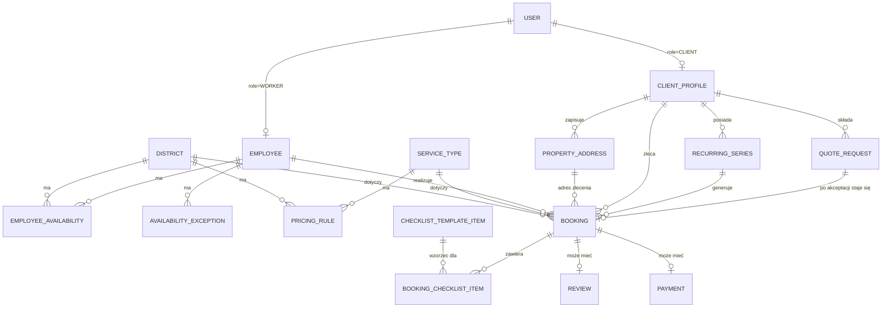

# Architektura i plan wdrożenia — system rezerwacji sprzątania

Status: dokument roboczy do wspólnego przeglądu. **Implementacja produkcyjna jeszcze się nie
rozpoczęła** — repo zawiera na razie tylko szkielet katalogów (patrz `package.json`, `apps/*`,
`packages/shared`, `prisma`).

---

## 1. Stack technologiczny i uzasadnienie

| Warstwa | Wybór | Uzasadnienie |
|---|---|---|
| Monorepo | pnpm workspaces + Turborepo | jedno repo, trzy aplikacje + pakiet współdzielony; Turborepo cache'uje build/test między aplikacjami korzystającymi z tego samego `packages/shared` |
| Frontend (×3) | Next.js (App Router) + TypeScript | jeden framework dla wszystkich trzech interfejsów, ale każdy jako **osobna aplikacja** (osobny `next.config`, osobny deployment) — nie jedna responsywna aplikacja na wszystko, zgodnie z wymogiem różnego podejścia do designu per interfejs |
| Stylowanie | Tailwind CSS | szybkie różnicowanie layoutów Mobile First (client, worker) vs Desktop-first (admin) bez narzutu customowego CSS frameworku |
| Panel admina — dodatkowo | TanStack Table (tabele/filtrowanie zleceń) + biblioteka kalendarza (np. FullCalendar) do widoku dostępności pracowników | admin ma pracować głównie na danych tabelarycznych i kalendarzu — to jedyny interfejs, gdzie warto zainwestować w cięższe komponenty desktopowe |
| Baza danych | PostgreSQL (Neon lub Supabase — managed) | jedna wspólna baza pod trzy aplikacje, zgodnie z wymogiem; managed Postgres upraszcza branching/backup na start |
| ORM / schemat | Prisma, schemat w `/prisma` w katalogu głównym | jeden `schema.prisma` jako źródło prawdy, generowany klient importowany przez `packages/shared` i stamtąd używany przez wszystkie trzy aplikacje |
| Warstwa API | **Brak osobnej aplikacji `apps/api`** — każda z trzech aplikacji Next.js ma własne Route Handlers / Server Actions, ale cała logika domenowa (walidacja, reguły cenowe, reguły dostępności, generowanie zleceń cyklicznych) leży w `packages/shared` i jest tylko **wywoływana** z każdej aplikacji | prostsze niż utrzymywanie czwartej usługi na MVP; "jedno wspólne API" realizujemy przez współdzieloną logikę + współdzielony schemat, nie przez współdzieloną usługę sieciową. Da się to później wydzielić do osobnego serwisu bez zmiany modelu danych, jeśli zajdzie potrzeba |
| Autentykacja | Auth.js (NextAuth) z sesją opartą o cookie na wspólnej domenie nadrzędnej (`.mojastrona.pl`) | pozwala na jedno logowanie rozpoznawane pod wszystkimi trzema subdomenami; autoryzacja per rola (`CLIENT`/`ADMIN`/`WORKER`) sprawdzana w middleware każdej aplikacji |
| Subdomeny | trzy osobne projekty Vercel wskazujące na ten sam monorepo, każdy z innym "root directory" (`apps/client`, `apps/admin`, `apps/worker`) i inną subdomeną | Vercel natywnie wspiera taki układ (monorepo → wiele projektów); nie wymaga customowego reverse-proxy |
| Płatności | moduł `packages/shared/payments` z interfejsem niezależnym od dostawcy (`createPayment`, `handleWebhook`, `refund`) | dostawca (Przelewy24 / Tpay / Autopay) jeszcze nie wybrany biznesowo — projektujemy jako wymienialny adapter, żeby decyzja nie blokowała startu prac nad resztą systemu |
| Powiadomienia | moduł `packages/shared/notifications`, niezależny od rdzenia rezerwacji, wywoływany asynchronicznie (nie blokuje potwierdzenia rezerwacji) | email (np. Resend) od razu w MVP jako tańszy/prostszy kanał; SMS jako adapter dodawany później — **transakcyjne od razu, marketingowe dopiero po zebraniu osobnej zgody RODO** (patrz `ClientProfile.marketingSmsConsent`) |
| Zadania cykliczne / przypomnienia | Vercel Cron wywołujący dedykowany Route Handler (generowanie kolejnych zleceń z serii cyklicznych, wysyłka przypomnień) | brak potrzeby osobnej infrastruktury kolejkowej na etapie MVP |
| Testy | Vitest (logika domenowa w `packages/shared`), Playwright (ścieżka rezerwacji end-to-end) | najwyższe ryzyko biznesowe leży w regułach cenowych/dostępności/cyklicznych — to jest to, co warto pokryć testami jednostkowymi w pierwszej kolejności |
| CI/CD | GitHub Actions (lint/typecheck/test na PR) + auto-deploy Vercel per aplikacja na push do `main` | standardowy, tani setup dla tej skali projektu |

---

## 2. Model danych

### Encje

**User** — wspólna tabela kont, `role: CLIENT | ADMIN | WORKER`, dane logowania.

**ClientProfile** (1:1 z User, role=CLIENT)
- `status: STANDARD | TRUSTED_RECURRING` — ustawiane wyłącznie ręcznie przez admina; odblokowuje
  opcję rezerwacji cyklicznej w koncie klienta.
- `marketingSmsConsent: boolean` + `marketingSmsConsentAt` — osobna zgoda RODO na SMS-y
  marketingowe, niezależna od transakcyjnych (potwierdzenia/przypomnienia nie jej wymagają).
- Konto jest **wymagane** przed pierwszą rezerwacją — brak ścieżki "rezerwacja jako gość".

**PropertyAddress** (Adres nieruchomości) — klient może zapisać wiele adresów na koncie
(`clientId`, etykieta, ulica/nr, `districtId`, ewentualnie domyślne m²) i wybrać jeden z listy
przy kolejnych rezerwacjach zamiast wpisywać go od nowa. **Dzielnica jest atrybutem adresu**
(adres fizycznie leży w konkretnej dzielnicy) — przy wyborze zapisanego adresu `districtId` w
rezerwacji ustawia się automatycznie z adresu, klient nie wybiera dzielnicy osobno.

**Employee** (1:1 z User, role=WORKER) — dane pracownika.

**District** (Dzielnica) — obszar obsługi.

**EmployeeAvailability** (Dostępność pracownika) — trójka `pracownik + dzielnica + dzień/godziny`,
cykliczny harmonogram tygodniowy. Jeden pracownik w danym terminie pracuje w **jednej**
dzielnicy — model celowo nie zakłada przemieszczania się między dzielnicami w ciągu dnia.

**AvailabilityException** (Wyjątek w dostępności) — nadpisuje harmonogram tygodniowy dla
konkretnej daty: `employeeId`, `date`, `type: DAY_OFF | CUSTOM_HOURS`, opcjonalnie
`startTime/endTime` przy `CUSTOM_HOURS` (np. urlop, L4, skrócony dzień pracy).

**ServiceType** (Rodzaj usługi) — osobna tabela edytowalna przez admina (np. "standardowe",
"generalne/po remoncie"), nie sztywny enum w kodzie — spójne z tym, że reszta cennika też jest
w pełni konfigurowalna z panelu, bez potrzeby wdrożenia nowej wersji kodu przy dodaniu rodzaju
usługi.

**PricingRule** (Cennik) — stawka i czas trwania wizyty zależne łącznie od `districtId`,
`serviceTypeId` i przedziału `sizeM2From–sizeM2To`: pola `price` oraz `durationMinutes`
(np. do 50 m² → X minut, 50–65 m² → Y minut, 65–75 m² → Z minut, itd. — ta sama logika
przedziałowa napędza jednocześnie cenę i długość okienka w kalendarzu pracownika).

**Settings** — pojedynczy rekord konfiguracyjny:
- `individualQuoteThresholdM2` (próg m², domyślnie 50, edytowalny przez admina)
- `operationalLockWindowHours` (domyślnie 24h, edytowalny przez admina) — po przekroczeniu tego
  progu przed wizytą przycisk samoobsługowej anulacji w koncie klienta jest wyszarzony
- `partialRefundPercentage` (domyślnie 50%, edytowalny przez admina) — procent zwrotu przy
  anulacji "po zamknięciu okna operacyjnego", ale **tylko** gdy rezerwacja nie podlega już
  ustawowemu prawu odstąpienia (patrz niżej)
- ustawowy termin odstąpienia konsumenta (14 dni, art. 27 ustawy o prawach konsumenta) jest
  **stałą aplikacyjną, nieedytowalną przez admina** (świadomie brak pola w Settings — to wymóg
  prawny, nie parametr biznesowy; admin nie powinien mieć możliwości przypadkowego złamania
  prawa poprzez zmianę tej wartości)

**Booking** (Zlecenie)
- `clientId`, `employeeId` (przypisany automatycznie lub ręcznie), `districtId`,
  `propertyAddressId`, `serviceType`, `sizeM2`, `scheduledStart/End` (długość wyliczona z
  `PricingRule.durationMinutes` w momencie rezerwacji), `price`, `createdAt`
- `status: PENDING | CONFIRMED | COMPLETED | CANCELLED | ISSUE`
- `source: ONLINE_STANDARD | RECURRING_GENERATED | FROM_QUOTE | ADMIN_MANUAL`
- `recurringSeriesId` (nullable) — powiązanie z serią, jeśli wygenerowane cyklicznie
- pola potwierdzenia realizacji: `completedAt`, `completionNote`, `completionPhotoUrl`
- pola anulacji: `cancelledAt`, `cancelledBy`, `statutoryWithdrawalEligibleAtCancellation`
  (boolean, nullable — snapshot wyniku reguły ustawowej **w momencie zgłoszenia anulacji**;
  status `ISSUE` służy osobno do ręcznego oznaczenia przez admina sytuacji spornej, np.
  pracownik się nie stawił — patrz sekcja 5 pkt 4 dla pełnej logiki zwrotu)

**ChecklistTemplateItem** — jeden globalny szablon checklisty, edytowalny przez admina w
panelu (treść pozycji, kolejność, aktywność). Przy tworzeniu `Booking` pozycje szablonu są
kopiowane do `BookingChecklistItem` (snapshot), więc późniejsza edycja szablonu nie zmienia
checklisty już utworzonych zleceń.

**BookingChecklistItem** — pozycje checklisty per zlecenie (skopiowane z
`ChecklistTemplateItem` w momencie utworzenia `Booking`) + status wykonania (checkbox).

**RecurringSeries** (Seria/subskrypcja cykliczna)
- `clientId`, `districtId`, `preferredEmployeeId` (nullable), `frequency: WEEKLY | BIWEEKLY`,
  `preferredDayOfWeek`, `preferredStartTime`, `sizeM2`, `status: ACTIVE | PAUSED | CANCELLED`,
  `createdBy: CLIENT | ADMIN` — z serii generowane są kolejne pojedyncze `Booking`.

**QuoteRequest** (Zapytanie o indywidualną wycenę) — osobna encja/status, niezależna od
standardowego `Booking`. **Nie wymaga zalogowania** — to lekki formularz kontaktowy (niższy próg
wejścia dla dużych nieruchomości), więc `clientId` jest **nullable**, a dane kontaktowe
(`contactName`, `contactPhone`, `contactEmail`) są zbierane wprost w formularzu niezależnie od
tego, czy zgłaszający ma już konto. Dalej: opis nieruchomości, `sizeM2`, `districtId`,
`status: NEW | IN_REVIEW | QUOTED | CONVERTED | REJECTED`, `quotedPrice`, `convertedBookingId`.
To tutaj admin ręcznie decyduje o ewentualnej większej ekipie — nie modelujemy encji "zespół" w
MVP.

**Payment** — zawsze **pełna kwota z góry** przy standardowej rezerwacji (bez zadatków/dowolnych
kwot w MVP). `bookingId` jest **nullable** celowo: przyszły moduł faktur dla stałych klientów
(płatność BLIK niepowiązana ze standardową rezerwacją online) nie będzie wymagał zmiany modelu.
`provider`, `providerPaymentId`, `status: PENDING | PAID | REFUNDED | PARTIALLY_REFUNDED | FAILED`,
`amount`, `type: BOOKING_PAYMENT | INVOICE (przyszłość)`, `refundedAt`, `refundPercentage`
(nullable — 100 albo `partialRefundPercentage` z Settings), `refundType: FULL_SELF_SERVICE |
FULL_STATUTORY_RIGHT | PARTIAL_POLICY | MANUAL_ISSUE` (nullable), `refundReason` (notatka admina,
istotna zwłaszcza przy `MANUAL_ISSUE`).

**Review** (Ocena) — `bookingId`, `rating`, `comment`, jeden per zakończone zlecenie.

---

## 3. Kluczowe przepływy (user flows)

### Klient — ścieżka standardowa
0. Logowanie/rejestracja (konto jest wymagane przed rezerwacją) → wybór zapisanego
   `PropertyAddress` albo dodanie nowego.
1. Wybór dzielnicy → podanie m² i rodzaju usługi (`serviceType`) nieruchomości.
2. Jeśli `sizeM2 > individualQuoteThresholdM2` → przycisk "Indywidualna wycena" → formularz
   `QuoteRequest` (bez płatności) → koniec ścieżki standardowej.
3. Jeśli w progu → system liczy cenę i czas trwania z `PricingRule` (dzielnica + rodzaj usługi +
   przedział m²) i pokazuje wolne okienka **w wybranej dzielnicy**, oparte o
   `EmployeeAvailability` i `AvailabilityException`, pomniejszone o istniejące `Booking`.
4. Jeśli w danym okienku dostępny jest więcej niż jeden pracownik → klient wybiera; jeśli jeden →
   przypisanie automatyczne, bez wyboru.
5. Płatność online od razu, pełna kwota → utworzenie `Booking(status=CONFIRMED)` →
   potwierdzenie.
6. Anulacja — patrz pełna logika w sekcji 5 pkt 4 (dwa niezależne progi: okno operacyjne 24h i
   ustawowe prawo odstąpienia 14 dni). W skrócie: do `operationalLockWindowHours` przed wizytą
   klient anuluje samoobsługowo, zwrot 100% automatyczny; po tym progu przycisk jest wyszarzony,
   a decyzję (pełny zwrot z mocy prawa albo potrącenie wg `partialRefundPercentage`) podejmuje
   admin na podstawie flagi wyliczonej przez system.
7. Po realizacji: klient może wystawić `Review`.

### Klient — ścieżka cykliczna (tylko status `TRUSTED_RECURRING`)
1. W koncie klienta pojawia się opcja "zleć usługę cykliczną" (widoczna wyłącznie po ręcznym
   nadaniu statusu przez admina).
2. Klient ustawia częstotliwość + preferowany dzień/godzinę/pracownika → powstaje
   `RecurringSeries`.
3. Cron generuje kolejne `Booking(source=RECURRING_GENERATED)` z **miesięcznym wyprzedzeniem**
   względem bieżącej daty (zawsze dopełnia okno do +1 miesiąc, w miarę jak starsze zlecenia się
   realizują).
4. Alternatywnie: admin tworzy/steruje serią całkowicie ręcznie, bez udziału klienta.

### Admin
- Zarządzanie dzielnicami, cennikiem (m² × dzielnica × rodzaj usługi, wraz z czasem trwania),
  progiem m², globalnym szablonem checklisty (`ChecklistTemplateItem`).
- Zarządzanie pracownikami, ich `EmployeeAvailability` (cykliczny harmonogram per dzielnica) oraz
  `AvailabilityException` (urlopy/L4/zmiany godzin per dzień).
- Lista `QuoteRequest` (osobno od zleceń standardowych) → ręczna wycena → ewentualna organizacja
  większej ekipy poza systemem → konwersja do `Booking`.
- Nadawanie/cofanie statusu `TRUSTED_RECURRING` klientom.
- Ręczne tworzenie/edycja `RecurringSeries` dla klienta.
- Podgląd i zarządzanie wszystkimi zleceniami (w tym generowanymi cyklicznie) i płatnościami;
  ręczne oznaczanie zlecenia jako `ISSUE` (np. pracownik się nie stawił) i ręczne zatwierdzanie
  zwrotu w takich spornych przypadkach (odróżnia to od automatycznego zwrotu przy zwykłej
  anulacji przez klienta do 24h przed wizytą).
- Podgląd ocen klientów.

### Pracownik
1. Logowanie → widok "Mój dzień": lista `Booking` przypisanych na dany dzień z adresem
   (z `PropertyAddress`).
2. Wejście w zlecenie → checklista (`BookingChecklistItem`, skopiowana z globalnego szablonu) do
   odhaczenia.
3. Obowiązkowe potwierdzenie wykonania (przycisk + opcjonalna notatka/zdjęcie) →
   `Booking.status = COMPLETED`. Jeśli usługa nie została wykonana, pracownik/admin oznacza
   zlecenie jako `ISSUE` zamiast `COMPLETED` — dalsza decyzja (zwrot, ponowny termin) należy do
   admina.

---

## 4. Etapy wdrożenia

**Etap 0 — szkielet.** Trzy puste aplikacje wdrożone na subdomenach, schemat Prisma, logowanie
i role, `packages/shared` z typami bazowymi. *(ten etap odpowiada obecnemu punktowi w repo)*

**Etap 1 — MVP: ścieżka standardowa.**
Admin: CRUD dzielnic, cennika, dostępności pracowników, progu m².
Klient: pełna ścieżka standardowa (wybór dzielnicy/m²/terminu, płatność online, potwierdzenie).
Pracownik: "Mój dzień", checklista, potwierdzenie realizacji.
Admin: podgląd zleceń i płatności.
→ To jest pierwsza wersja, którą można realnie uruchomić komercyjnie dla jednoosobowych zleceń.

**Etap 2 — indywidualna wycena.** Formularz `QuoteRequest` po stronie klienta + panel obsługi
zapytań i konwersji do zlecenia po stronie admina.

**Etap 3 — rezerwacje cykliczne.** Status `TRUSTED_RECURRING`, `RecurringSeries`, generator
kolejnych zleceń (cron), opcja cykliczna w koncie klienta oraz ręczne tworzenie serii przez
admina.

**Etap 4 — oceny i powiadomienia.** `Review` po stronie klienta + podgląd ocen w adminie;
moduł powiadomień e-mail/SMS (potwierdzenia, przypomnienia przed wizytą).

**Etap 5 — rozszerzenia.** Moduł faktur z płatnością BLIK dla stałych klientów o ustalonej
indywidualnej cenie; dopracowanie PWA panelu pracownika; kolejne miasta/dzielnice.

---

## 5. Ustalone decyzje biznesowe

Poniższe reguły zostały potwierdzone i są już odzwierciedlone w modelu danych i przepływach
powyżej — nie są to już otwarte pytania.

1. **Cennik:** stawka zależy łącznie od dzielnicy, rodzaju usługi i przedziału m² (`PricingRule`).
2. **Model płatności:** zawsze pełna kwota z góry przy standardowej rezerwacji — bez zadatków ani
   dowolnych kwot w MVP.
3. **Checklista:** jeden globalny szablon (`ChecklistTemplateItem`), edytowalny przez admina;
   kopiowany do konkretnego zlecenia w momencie jego utworzenia.
4. **Anulacja i zwrot — dwa niezależne progi, nie jedna sztywna reguła:**
   - `operationalLockWindowHours` (domyślnie 24h przed wizytą, edytowalne w Settings) — próg
     **operacyjny**: do tego momentu klient anuluje samoobsługowo w koncie, zwrot **100%
     automatyczny**. Po przekroczeniu progu przycisk anulacji w panelu klienta jest wyszarzony,
     z komunikatem kierującym do kontaktu z administratorem (bez podawania z góry wysokości
     zwrotu w UI — bo zależy to od pkt niżej).
   - `statutoryWithdrawalDays` = **14 dni od zawarcia umowy** (czyli od `Booking.createdAt`,
     nie od terminu wizyty) — **ustawowe** prawo odstąpienia konsumenta (art. 27 ustawy o
     prawach konsumenta), stała aplikacyjna, **nieedytowalna** przez admina.
   - Logika po stronie systemu, gdy klient zgłasza anulację **po** zamknięciu okna
     operacyjnego: jeśli od utworzenia rezerwacji minęło mniej niż `statutoryWithdrawalDays`,
     system oznacza rezerwację flagą **"podlega ustawowemu prawu odstąpienia — należny pełny
     zwrot"** w panelu admina (admin obsługuje ręcznie, ale system wskazuje mu jednoznacznie
     wymagany wynik, nie zostawia tego "na oko"); jeśli minęło więcej — flaga **"poza okresem
     ochronnym — możliwe potrącenie zgodnie z regulaminem"**, a zwrot = `partialRefundPercentage`.
   - Wynik tej reguły jest zapisywany jako snapshot na `Booking.statutoryWithdrawalEligibleAtCancellation`
     w momencie zgłoszenia anulacji (nie przeliczany później retroaktywnie), a faktycznie
     wykonany zwrot opisuje `Payment.refundType` / `refundPercentage`.
   - Rekompensata dla pracownika za "puste okno" w grafiku przy anulacjach objętych pełnym
     zwrotem klienta to **osobny, niepowiązany mechanizm** (nie wpływa na logikę zwrotu klienta)
     — świadomie odłożony poza zakres MVP, do rozważenia w dalszych etapach.
   - ⚠️ Zakres ustawowego prawa odstąpienia dla usług sprzątania (czy nie zachodzi tu któryś z
     wyjątków z art. 38 ustawy o prawach konsumenta) warto potwierdzić z prawnikiem przed
     wdrożeniem produkcyjnym — model danych jest przygotowany na obie interpretacje, ale sama
     reguła prawna nie jest tu przez nas asertowana jako pewnik.
5. **Niewykonanie usługi:** admin ręcznie oznacza zlecenie jako `ISSUE` i ręcznie decyduje o
   zwrocie — brak automatyzacji dla tego przypadku (celowo odróżnione od zwrotu przy zwykłej
   anulacji).
6. **Adresy klienta:** klient może zapisać wiele adresów (`PropertyAddress`) i wybierać z listy.
7. **Konto:** wymagane przed pierwszą rezerwacją — brak ścieżki "gość".
8. **Czas trwania wizyty:** wynika z tych samych przedziałów m² co cena (`PricingRule.durationMinutes`),
   różny w zależności od dzielnicy/rodzaju usługi.
9. **Wyjątki w dostępności:** potrzebne w MVP — admin edytuje wyjątki per dzień
   (`AvailabilityException`), niezależnie od cyklicznego harmonogramu tygodniowego.
10. **Generowanie zleceń cyklicznych:** z wyprzedzeniem całego miesiąca względem bieżącej daty
    (cron dopełnia okno na bieżąco).
11. **Dostawca płatności:** jeszcze nie wybrany — moduł płatności projektujemy jako wymienialny
    adapter (Przelewy24 / Tpay / Autopay do wyboru później, bez zmiany reszty systemu).
12. **Powiadomienia SMS:** zbieramy osobną zgodę marketingową RODO (`marketingSmsConsent`) już od
    MVP, niezależną od transakcyjnych przypomnień/potwierdzeń, które jej nie wymagają.
