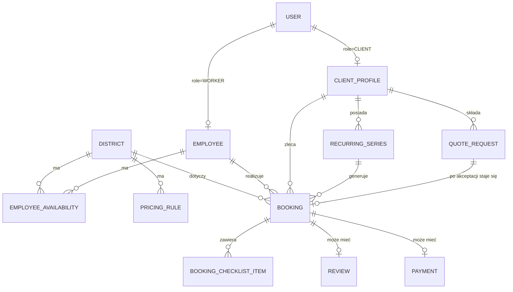

# Architektura i plan wdrożenia — system rezerwacji sprzątania

Status: dokument roboczy do wspólnego przeglądu. **Implementacja produkcyjna jeszcze się nie
rozpoczęła** — repo zawiera na razie tylko szkielet katalogów (patrz `package.json`, `apps/*`,
`packages/shared`, `prisma`).

---

## 1. Stack technologiczny i uzasadnienie

| Warstwa | Wybór | Uzasadnienie |
|---|---|---|
| Monorepo | pnpm workspaces + Turborepo | jedno repo, trzy aplikacje + pakiet współdzielony; Turborepo cache'uje build/test między aplikacjami korzystającymi z tego samego `packages/shared` |
| Frontend (×3) | Next.js (App Router) + TypeScript | jeden framework dla wszystkich trzech interfejsów, ale każdy jako **osobna aplikacja** (osobny `next.config`, osobny deployment) — nie jedna responsywna aplikacja na wszystko, zgodnie z wymogiem różnego podejścia do designu per interfejs |
| Stylowanie | Tailwind CSS | szybkie różnicowanie layoutów Mobile First (client, worker) vs Desktop-first (admin) bez narzutu customowego CSS frameworku |
| Panel admina — dodatkowo | TanStack Table (tabele/filtrowanie zleceń) + biblioteka kalendarza (np. FullCalendar) do widoku dostępności pracowników | admin ma pracować głównie na danych tabelarycznych i kalendarzu — to jedyny interfejs, gdzie warto zainwestować w cięższe komponenty desktopowe |
| Baza danych | PostgreSQL (Neon lub Supabase — managed) | jedna wspólna baza pod trzy aplikacje, zgodnie z wymogiem; managed Postgres upraszcza branching/backup na start |
| ORM / schemat | Prisma, schemat w `/prisma` w katalogu głównym | jeden `schema.prisma` jako źródło prawdy, generowany klient importowany przez `packages/shared` i stamtąd używany przez wszystkie trzy aplikacje |
| Warstwa API | **Brak osobnej aplikacji `apps/api`** — każda z trzech aplikacji Next.js ma własne Route Handlers / Server Actions, ale cała logika domenowa (walidacja, reguły cenowe, reguły dostępności, generowanie zleceń cyklicznych) leży w `packages/shared` i jest tylko **wywoływana** z każdej aplikacji | prostsze niż utrzymywanie czwartej usługi na MVP; "jedno wspólne API" realizujemy przez współdzieloną logikę + współdzielony schemat, nie przez współdzieloną usługę sieciową. Da się to później wydzielić do osobnego serwisu bez zmiany modelu danych, jeśli zajdzie potrzeba |
| Autentykacja | Auth.js (NextAuth) z sesją opartą o cookie na wspólnej domenie nadrzędnej (`.mojastrona.pl`) | pozwala na jedno logowanie rozpoznawane pod wszystkimi trzema subdomenami; autoryzacja per rola (`CLIENT`/`ADMIN`/`WORKER`) sprawdzana w middleware każdej aplikacji |
| Subdomeny | trzy osobne projekty Vercel wskazujące na ten sam monorepo, każdy z innym "root directory" (`apps/client`, `apps/admin`, `apps/worker`) i inną subdomeną | Vercel natywnie wspiera taki układ (monorepo → wiele projektów); nie wymaga customowego reverse-proxy |
| Płatności | moduł `packages/shared/payments` z interfejsem niezależnym od dostawcy (`createPayment`, `handleWebhook`, `refund`), pierwsza implementacja: **Przelewy24 lub Tpay** (oba wspierają BLIK) | zgodnie z wymogiem wymienialności dostawcy; wybór Przelewy24 vs Tpay do ustalenia biznesowo (pytanie niżej) |
| Powiadomienia | moduł `packages/shared/notifications`, niezależny od rdzenia rezerwacji, wywoływany asynchronicznie (nie blokuje potwierdzenia rezerwacji) | email (np. Resend) od razu w MVP jako tańszy/prostszy kanał, SMS jako adapter dodawany, gdy wybierzemy dostawcę (SMSAPI.pl / SerwerSMS / inny) |
| Zadania cykliczne / przypomnienia | Vercel Cron wywołujący dedykowany Route Handler (generowanie kolejnych zleceń z serii cyklicznych, wysyłka przypomnień) | brak potrzeby osobnej infrastruktury kolejkowej na etapie MVP |
| Testy | Vitest (logika domenowa w `packages/shared`), Playwright (ścieżka rezerwacji end-to-end) | najwyższe ryzyko biznesowe leży w regułach cenowych/dostępności/cyklicznych — to jest to, co warto pokryć testami jednostkowymi w pierwszej kolejności |
| CI/CD | GitHub Actions (lint/typecheck/test na PR) + auto-deploy Vercel per aplikacja na push do `main` | standardowy, tani setup dla tej skali projektu |

---

## 2. Model danych

### Encje

**User** — wspólna tabela kont, `role: CLIENT | ADMIN | WORKER`, dane logowania.

**ClientProfile** (1:1 z User, role=CLIENT)
- `status: STANDARD | TRUSTED_RECURRING` — ustawiane wyłącznie ręcznie przez admina; odblokowuje
  opcję rezerwacji cyklicznej w koncie klienta.

**Employee** (1:1 z User, role=WORKER) — dane pracownika.

**District** (Dzielnica) — obszar obsługi.

**EmployeeAvailability** (Dostępność pracownika) — trójka `pracownik + dzielnica + dzień/godziny`.
Jeden pracownik w danym terminie pracuje w **jednej** dzielnicy — model celowo nie zakłada
przemieszczania się między dzielnicami w ciągu dnia. Potrzebny będzie mechanizm wyjątków
(urlop/L4) ponad cykliczny harmonogram tygodniowy — patrz pytania niżej.

**PricingRule** (Cennik) — stawka zależna co najmniej od `sizeM2` (przedziały wielkości);
możliwe dodatkowe różnicowanie po dzielnicy — do potwierdzenia.

**Settings** — pojedynczy rekord konfiguracyjny, m.in. `individualQuoteThresholdM2` (próg m²,
domyślnie 50, edytowalny przez admina).

**Booking** (Zlecenie)
- `clientId`, `employeeId` (przypisany automatycznie lub ręcznie), `districtId`,
  `propertyAddress`, `sizeM2`, `scheduledStart/End`, `price`
- `status: PENDING | CONFIRMED | COMPLETED | CANCELLED`
- `source: ONLINE_STANDARD | RECURRING_GENERATED | FROM_QUOTE | ADMIN_MANUAL`
- `recurringSeriesId` (nullable) — powiązanie z serią, jeśli wygenerowane cyklicznie
- pola potwierdzenia realizacji: `completedAt`, `completionNote`, `completionPhotoUrl`

**BookingChecklistItem** — pozycje checklisty per zlecenie + status wykonania (checkbox).
Zakres/źródło szablonu checklisty — do ustalenia (patrz pytania).

**RecurringSeries** (Seria/subskrypcja cykliczna)
- `clientId`, `districtId`, `preferredEmployeeId` (nullable), `frequency: WEEKLY | BIWEEKLY`,
  `preferredDayOfWeek`, `preferredStartTime`, `sizeM2`, `status: ACTIVE | PAUSED | CANCELLED`,
  `createdBy: CLIENT | ADMIN` — z serii generowane są kolejne pojedyncze `Booking`.

**QuoteRequest** (Zapytanie o indywidualną wycenę) — osobna encja/status, niezależna od
standardowego `Booking`: dane kontaktowe, opis nieruchomości, `sizeM2`, `districtId`,
`status: NEW | IN_REVIEW | QUOTED | CONVERTED | REJECTED`, `quotedPrice`,
`convertedBookingId`. To tutaj admin ręcznie decyduje o ewentualnej większej ekipie —
nie modelujemy encji "zespół" w MVP.

**Payment** — `bookingId` jest **nullable** celowo: przyszły moduł faktur dla stałych klientów
(płatność BLIK niepowiązana ze standardową rezerwacją online) nie będzie wymagał zmiany modelu.
`provider`, `providerPaymentId`, `status`, `amount`, `type: BOOKING_PAYMENT | INVOICE (przyszłość)`.

**Review** (Ocena) — `bookingId`, `rating`, `comment`, jeden per zakończone zlecenie.

---

## 3. Kluczowe przepływy (user flows)

### Klient — ścieżka standardowa
1. Wybór dzielnicy → podanie m² nieruchomości.
2. Jeśli `sizeM2 > individualQuoteThresholdM2` → przycisk "Indywidualna wycena" → formularz
   `QuoteRequest` (bez płatności) → koniec ścieżki standardowej.
3. Jeśli w progu → system pokazuje wolne okienka **w wybranej dzielnicy**, oparte o
   `EmployeeAvailability` pomniejszone o istniejące `Booking`.
4. Jeśli w danym okienku dostępny jest więcej niż jeden pracownik → klient wybiera; jeśli jeden →
   przypisanie automatyczne, bez wyboru.
5. Płatność online od razu (pełna kwota — model zadatku/dowolnej kwoty do ustalenia, patrz
   pytania) → utworzenie `Booking(status=CONFIRMED)` → potwierdzenie.
6. Po realizacji: klient może wystawić `Review`.

### Klient — ścieżka cykliczna (tylko status `TRUSTED_RECURRING`)
1. W koncie klienta pojawia się opcja "zleć usługę cykliczną" (widoczna wyłącznie po ręcznym
   nadaniu statusu przez admina).
2. Klient ustawia częstotliwość + preferowany dzień/godzinę/pracownika → powstaje
   `RecurringSeries`.
3. System cyklicznie generuje kolejne `Booking(source=RECURRING_GENERATED)` zgodnie z serią.
4. Alternatywnie: admin tworzy/steruje serią całkowicie ręcznie, bez udziału klienta.

### Admin
- Zarządzanie dzielnicami, cennikiem, progiem m².
- Zarządzanie pracownikami i ich `EmployeeAvailability` (dzień/godziny per dzielnica).
- Lista `QuoteRequest` (osobno od zleceń standardowych) → ręczna wycena → ewentualna organizacja
  większej ekipy poza systemem → konwersja do `Booking`.
- Nadawanie/cofanie statusu `TRUSTED_RECURRING` klientom.
- Ręczne tworzenie/edycja `RecurringSeries` dla klienta.
- Podgląd i zarządzanie wszystkimi zleceniami (w tym generowanymi cyklicznie), płatnościami,
  ocenami.

### Pracownik
1. Logowanie → widok "Mój dzień": lista `Booking` przypisanych na dany dzień z adresem.
2. Wejście w zlecenie → checklista (`BookingChecklistItem`) do odhaczenia.
3. Obowiązkowe potwierdzenie wykonania (przycisk + opcjonalna notatka/zdjęcie) →
   `Booking.status = COMPLETED`.

---

## 4. Etapy wdrożenia

**Etap 0 — szkielet.** Trzy puste aplikacje wdrożone na subdomenach, schemat Prisma, logowanie
i role, `packages/shared` z typami bazowymi. *(ten etap odpowiada obecnemu punktowi w repo)*

**Etap 1 — MVP: ścieżka standardowa.**
Admin: CRUD dzielnic, cennika, dostępności pracowników, progu m².
Klient: pełna ścieżka standardowa (wybór dzielnicy/m²/terminu, płatność online, potwierdzenie).
Pracownik: "Mój dzień", checklista, potwierdzenie realizacji.
Admin: podgląd zleceń i płatności.
→ To jest pierwsza wersja, którą można realnie uruchomić komercyjnie dla jednoosobowych zleceń.

**Etap 2 — indywidualna wycena.** Formularz `QuoteRequest` po stronie klienta + panel obsługi
zapytań i konwersji do zlecenia po stronie admina.

**Etap 3 — rezerwacje cykliczne.** Status `TRUSTED_RECURRING`, `RecurringSeries`, generator
kolejnych zleceń (cron), opcja cykliczna w koncie klienta oraz ręczne tworzenie serii przez
admina.

**Etap 4 — oceny i powiadomienia.** `Review` po stronie klienta + podgląd ocen w adminie;
moduł powiadomień e-mail/SMS (potwierdzenia, przypomnienia przed wizytą).

**Etap 5 — rozszerzenia.** Moduł faktur z płatnością BLIK dla stałych klientów o ustalonej
indywidualnej cenie; dopracowanie PWA panelu pracownika; kolejne miasta/dzielnice.

---

## 5. Pytania doprecyzowujące (bez odpowiedzi nie zgaduję tych reguł)

1. **Cennik:** czy stawka zależy wyłącznie od m² (przedziały), czy też różni się między
   dzielnościami lub w zależności od rodzaju sprzątania (np. standardowe vs. generalne/po
   remoncie)?
2. **Model płatności:** pełna kwota z góry przy każdej standardowej rezerwacji, czy jednak
   wariant zadatku / dowolnej kwoty (wspomniany w analizie nakiedy.pl) też ma być dostępny?
3. **Zakres checklisty:** jeden globalny szablon dla każdego zlecenia, czy różne szablony w
   zależności od wielkości/rodzaju usługi? Kto go edytuje — czy to ma być konfigurowalne przez
   admina, czy na sztywno w kodzie na MVP?
4. **Reguły anulacji:** ile godzin przed wizytą klient może anulować bez konsekwencji? Czy zwrot
   płatności przy anulacji jest automatyczny, czy zawsze ręcznie zatwierdzany przez admina?
5. **Niewykonanie usługi:** co się dzieje z płatnością i statusem zlecenia, jeśli pracownik nie
   potwierdzi realizacji (np. nie dotarł)? Czy potrzebny jest w MVP jakikolwiek proces
   reklamacji/interwencji admina?
6. **Adresy klienta:** czy klient może zapisać wiele nieruchomości na koncie (do wyboru przy
   kolejnych rezerwacjach), czy każda rezerwacja to jednorazowo wpisywany adres?
7. **Konto vs. rezerwacja bez konta:** czy założenie konta jest wymagane przed dokonaniem
   pierwszej rezerwacji, czy dopuszczamy "rezerwację jako gość" z kontem tworzonym przy okazji
   (np. przez ustawienie hasła po fakcie)?
8. **Czas trwania wizyty:** czy długość zajmowanego okienka w kalendarzu pracownika wynika z
   reguły zależnej od m² (np. X minut na m²), czy jest ustawiana ręcznie przez admina w cenniku?
9. **Wyjątki w dostępności pracownika:** poza cyklicznym harmonogramem tygodniowym, czy
   potrzebny jest w MVP mechanizm jednorazowych wyjątków (urlop, L4, zmiana godzin danego dnia),
   czy to zarządzane będzie ręcznie przez admina edytującego harmonogram na bieżąco?
10. **Generowanie zleceń cyklicznych:** z jakim wyprzedzeniem system ma generować kolejne
    pojedyncze zlecenia z serii (np. tylko następne, czy zawsze N tygodni naprzód)? Co się dzieje,
    gdy w wygenerowanym terminie preferowany pracownik akurat nie jest dostępny — automatyczne
    wstrzymanie serii, czy propozycja zastępstwa do ręcznej decyzji admina?
11. **Dostawca płatności:** Przelewy24 czy Tpay/Autopay — czy jest już preferencja/umowa z
    konkretnym dostawcą?
12. **Powiadomienia SMS:** czy potrzebna jest osobna zgoda marketingowa RODO, czy SMS-y mają być
    wyłącznie transakcyjne (potwierdzenie/przypomnienie w ramach realizacji umowy, bez zgody
    marketingowej)?
